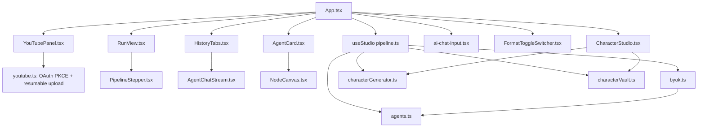
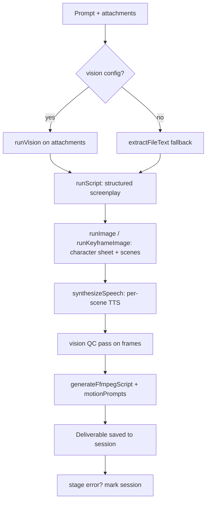
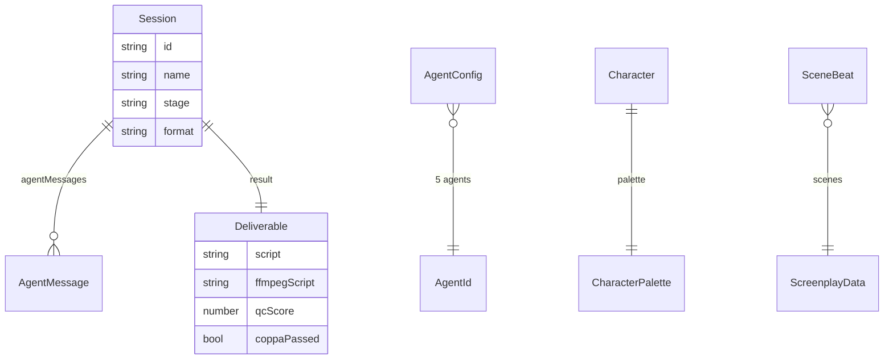
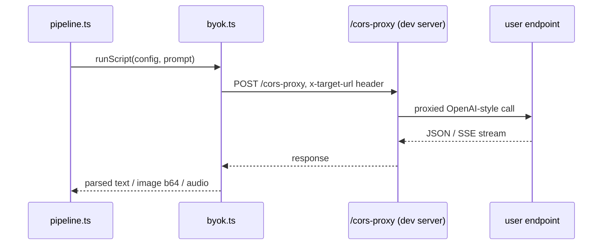

# YouTubeKids Studio — Architecture

AI kids-YouTube video studio. React 19 + Vite + Tailwind 4. 5 BYOK agents (script/image/voice/vision/monitor) — keys stay in browser, API calls go through dev-server CORS proxy.

## Module graph

## Pipeline run flow

## Data model

## BYOK request flow

